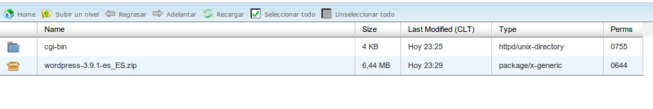
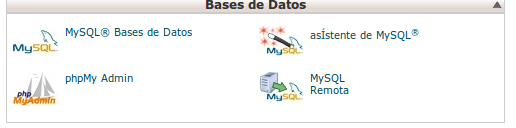
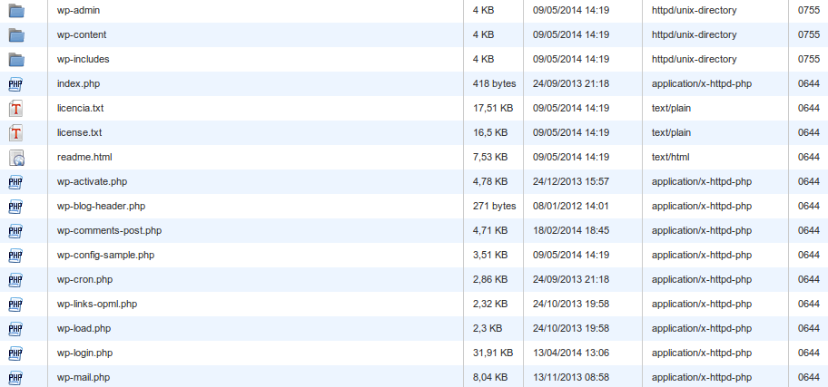
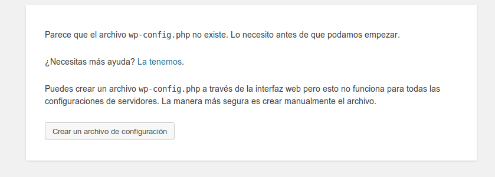
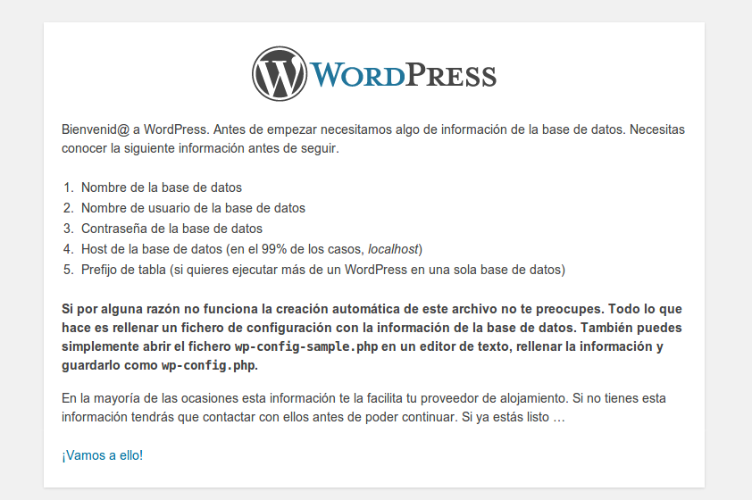
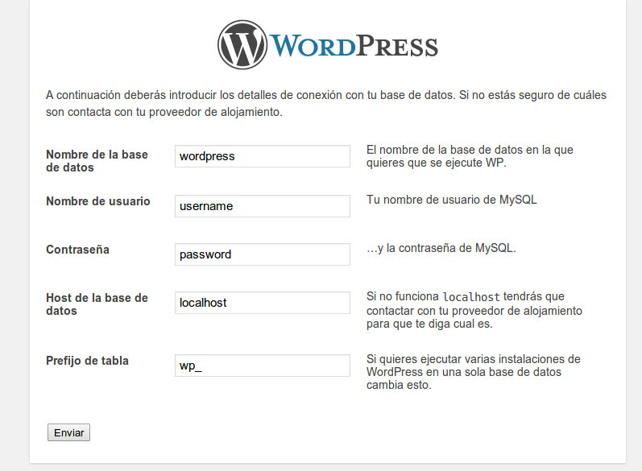
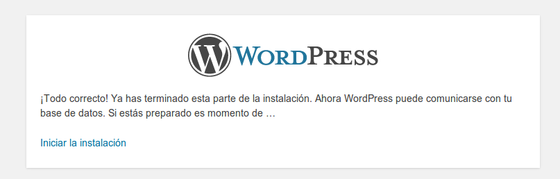
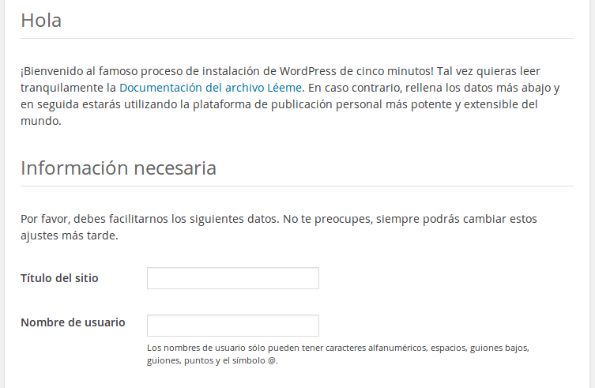
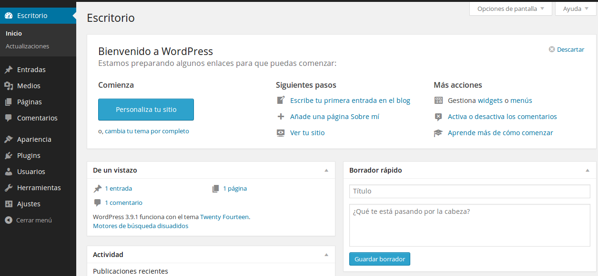

# Configurando WebPay KCC con WooCommerce
La siguiente guía detallará el proceso de configuración de una tienda en línea utilizando WooCommerce y Webpay KCC. Se asume que el KCC está correctamente configurado en la tienda (ver guía correspondiente).

## Paso 1 - Instalar Wordpress
[WooCommerce](http://www.woothemes.com/woocommerce/) funciona con el CMS Wordpress, antes de comenzar con la tienda se debe instalar correctamente este sistema.

En primer lugar descargamos los archivos desde la [página oficial](http://es.wordpress.org/) y lo subimos a nuestro hosting, como lo muestra la figura 1.

            Figura 1: Wordpress comprimido subido al hosting
                
Se debe también crear una base de datos y un usuario con los permisos para administrarla. Normalmente el panel administrativo del hosting tendrá una sección para este propósito. En la figura 2 se muestra el panel de cPanel.

        Figura 2: Administrador de Base de datos de cPanel
        

Al descomprimir el zip de Wordpress podemos encontrar una imagen similar a la figura 3.

                Figura 3: Wordpress descomprimido
        
Luego se debe ingresar a la dirección web donde están los archivos que fueron descomprimidos,  ejemplo: *http://cervezas.cl/wordpress* y se verá una imagen parecida a la figura 4.

                Figura 4: Instalación de Wordpress paso 1

Al hacer click en "Crear un archivo de configuración" se muestra la imagen de la figura 5.

        Figura 5: Mensaje preliminar de la instalación de Wordpress
                

Al continuar se nos solicita ingresar los datos de conexión a la base de datos. Esto se muestra en la figura 6.

                Figura 6: Datos de conexión a la BD
        

Si fueron ingresados exitosamente, se mostrará el mensaje de la figura 7.

            Figura 7: Datos de conexión ingresados con éxito
    
Al continuar se nos preguntará información básica del sitio como título, usuario administrador, correo y visibilidad en buscadores. La figura 8 muestra esta pantalla.

    
            Figura 8: Datos iniciales del sitio
            

Finalmente nos pedirá el usuario y contraseña que ingresamos y veremos el panel de administración de Wordpress, como muestra la figura 9.

            Figura 9: Panel de Administración de Wordpress
            
