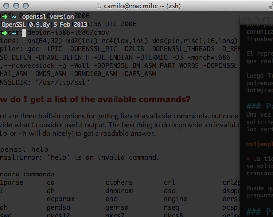

## Proceso de API SOAP OneClick WebPay
La sección a continuación presenta el proceso de integrar un sistema al servidor de OneClick de Transbank, utilizando el lenguaje PHP 5.4.

### Paso 1 - Registro del desarrollador

En primer lugar se debe contactar con el administrador del sistema WebPay asignado, para poder acceder a la información necesaria para implementar el sistema. Toda la comunicación es realizada mediante un sistema de correos seguro provisto por Transbank.

El representante legal de la empresa debe notificar a Transbank sobre la persona que realizará la integración, de forma que pueda recibir ésta información.

Luego Transbank enviará el acceso al servidor de correos seguro, con el cual podremos comunicarnos con el administrador asociado durante todo el proceso de integración.

### Paso 2 - Solicitud de Códigos de Comercio y envío de Logotipo
Una vez que se ha ingresado al servidor de correos seguro de Transbank, se debe solicitar el código de comercio para ambiente de desarrollo, necesario para crear los certificados.

**Ejemplo**

> La tienda Cervezapps ha contratado los servicios WebPay Plus (SOAP) y OneClick, se solicita los códigos de comercio en ambiente de desarrollo para el tipo de transacción Normal y OneClick.

Puede que la tienda ya los tenga asignados previamente, por lo que primero es preguntar a la misma sobre dichos códigos.

#### Logotipo
Un logotipo de la tienda debe ser enviado, este debe ser en formato *gif* y de tamaño 130x60 px. Debe destacar sobre fondo blanco.


### Paso 3 - Generación de Certificados
El código de comercio es usado para generar los certificados. Los certificados son creados con el programa [OpenSSL](https://www.openssl.org/).

#### 3.1 - Instalar OpenSSL
Para sistemas Windows puede ser descargado desde [OpenSSL for Windows](http://slproweb.com/products/Win32OpenSSL.html). Los comandos utilizados sirven para sistemas **Linux** o **Mac**. Puede que para sistemas **Windows** se deban utilizar otros comandos. Una alternativa es utilizar una máquina virtual con **Linux** para ejecutar los comandos. La siguiente guía explica como hacer esto y está disponible en el siguiente enlace : [Virtualizar Ubuntu en Windows](http://blog.uptodown.com/tutorial-virtualizar-ubuntu-14-virtualbox/).

Para instalar OpenSSL en Linux (Ubuntu) se debe utilizar el siguiente comando:

```
# apt-get install openssl
```

**Nota**
> El símbolo $ indica que el comando se ejecuta con privilegios de usuario. El símbolo # indica que el comando se ejecuta con privilegios de administrador.


Para sistemas Mac, OpenSSL viene pre instalado.

Una vez que instalamos el programa OpenSSL, debemos abrir una *terminal* para ejecutarlo.


Al introducir *openssl version* en la línea de comando, nos debería aparecer una información similar a la siguiente:


```
$ openssl version
OpenSSL 0.9.8y 5 Feb 2013
```

La figura 1 ilustra una terminal *zsh* con la ejecución del comando.

<center></center>

			Figura 1: Ejecución de openssl en terminal

#### 3.2 - Crear Llave Privada	

Para ejemplificar, utilizaremos el código de comercio *597029124456*. Este debe ser reemplazado por el código de comercio asignado a la tienda.

En primer lugar crearemos un directorio para guardar los certificados con el comando *mkdir* y luego accederemos en su interior con *cd*.

El siguiente comando realiza estas dos acciones

```
$ mkdir certs && cd certs

```

Luego crearemos la llave privada llamada *597029124456.key* con el comando 

```
$ openssl genrsa -out 597029124456.key 2048
```

 El resultado es similar a lo siguiente:

```
$ openssl genrsa -out 597029124456.key 2048
Generating RSA private key, 2048 bit long modulus
.....................................................................................................+++
..................+++
e is 65537 (0x10001)
```

**Nota**
> La llave privada es importante resguardarla en un lugar seguro, ya que es usada para generar los certificados.


Teniendo la llave privada, se puede generar los certificados público (*.crt*) y privado (*.csr*). El certificado público será enviado a Transbank posteriormente.

#### 3.3 - Crear Certificado Privado
Para crear el certificado privado (*.csr*) se debe utilizar el siguiente comando:

```
$ openssl req -new -key 597029124456.key -out 597029124456.csr
```

La ejecución de este comando nos solicitará diferentes datos, los cuales deben ser llenados de la siguiente forma:

| Campo | Valor | 
| ------------ | ------------- | 
| Country Name (2 letter code) [] | CL  | 
| State or Province Name (full name)[] | Vacío (Precionar enter o escribir un punto '.')  | 
| Locality Name (eg, city) [] | SANTIAGO|
| Organization Name (eg, company) []|Vacío|
| Organizational Unit Name (eg, section) []|Vacío|
| Common Name (eg, your name or your server's hostname) []|597029124456 (Código de Comercio)|
|Email Address []|Vacío|
|A challenge password []| Vacío|
|An optional company name []|Vacío|

**Nota**
> Es importante que el campo **Common Name** sea el código de comercio asociado a la tienda.

La ejecución del comando mostraría el siguiente resultado:

```
$ openssl req -new -key 597029124456.key -out 597029124456.csr

You are about to be asked to enter information that will be incorporated
into your certificate request.
What you are about to enter is what is called a Distinguished Name or a DN.
There are quite a few fields but you can leave some blank
For some fields there will be a default value,
If you enter '.', the field will be left blank.
-----
Country Name (2 letter code) [AU]:CL
State or Province Name (full name) [Some-State]:
Locality Name (eg, city) []:SANTIAGO
Organization Name (eg, company) [Internet Widgits Pty Ltd]:
Organizational Unit Name (eg, section) []:
Common Name (e.g. server FQDN or YOUR name) []:597029124456
Email Address []:

Please enter the following 'extra' attributes
to be sent with your certificate request
A challenge password []:
An optional company name []:
```


#### 3.4 - Crear Certificado Público
Ahora se debe crear el certificado público (*.crt*). El cual debe ser enviado a Transbank. Para ello usaremos el siguiente comando:

```
$ openssl x509 -req -days 1460 -in 597029124456.csr -signkey 597029124456.key -out 597029124456.crt

```

El resultado sería similar a lo siguiente:

```
$ openssl x509 -req -days 1460 -in 597029124456.csr -signkey 597029124456.key -out 597029124456.crt
Signature ok
subject=/C=CL/ST=Some-State/L=SANTIAGO/O=Internet Widgits Pty Ltd/CN=597029124456
Getting Private key
```

**Nota**
> Este certificado tiene una validez de 1460 días (4 años) el cual debe ser renovado antes que expire.

#### 3.5 - Envío de Certificado a Transbank
Al ejecutar el comando *ls* deberían mostrarse 3 archivos (key, csr y crt).

```
$ ls
597029124456.crt 597029124456.csr 597029124456.key
```

El archivo *597029124456.crt* debe ser comprimido en un zip y ser enviado por medio del sistema de correos seguro de Transbank. Para ello utilizamos el comando *zip*.

```
$ zip certificado.zip 597029124456.crt
```

El resultado del comando sería:

```
$ zip certificado.zip 597029124456.crt
  adding: 597029124456.crt (deflated 25%)
```

Luego de ejecutar el comando, al listar el directorio obtendremos el siguiente resultado:

```
$ ls
597029124456.crt 597029124456.csr 597029124456.key certificado.zip
```

Para finalizar, enviamos *certificado.zip* por el sistema de correos seguro al administrador de Transbank asociado.
